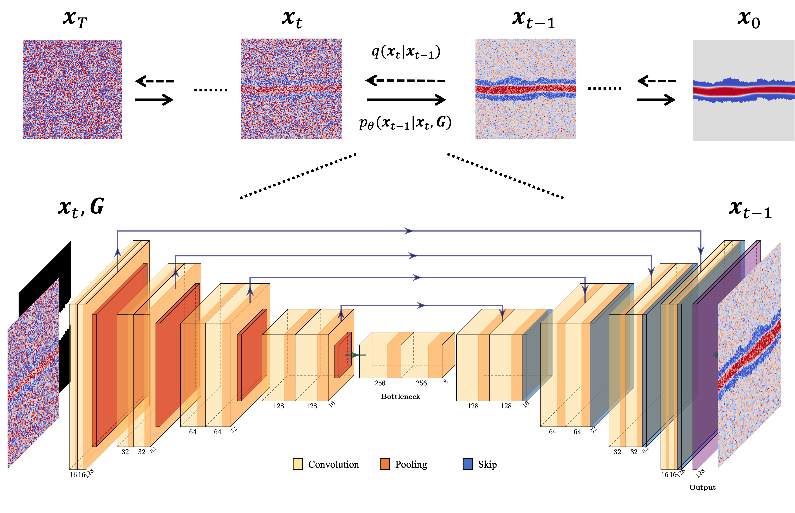
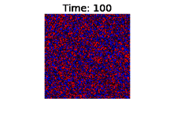

# Diffusion Models for Multiphase Fluids in Fractures

This repository contains implementations of diffusion models for studying multiphase fluids in fractures using deep learning. The main components of the project include training and sampling scripts.


*Diagram depicting the diffusion process and the integration of a geometry channel to guide fluid configurations within predefined geometric constraints.*

<p align="center">
  
  
</p>
*Left: Input Image, Right: GIF showing the denoising process and the integration of a geometry channel to guide fluid configurations within predefined geometric constraints.*


## Requirements

To set up the environment and install the necessary packages, please follow the instructions below.

### Installation

1. **Clone the repository:**

    ```sh
    git clone https://github.com/yourusername/diffusion-fractures.git
    cd diffusion-fractures
    ```

2. **Create a virtual environment:**

    ```sh
    conda create -n diffusion python=3.9
    conda activate diffusion
    ```

3. **Install the required packages:**

    ```sh
    pip install -r requirements.txt
    ```

### Requirements File

Ensure you have a `requirements.txt` file in the repository root with the necessary packages.

## Usage

### Training

The `train.py` script is used to train the diffusion model.

#### Arguments:

- `--dim`: Dimensionality for the UNET model (default: 16)
- `--timesteps`: Number of timesteps for Gaussian Diffusion (default: 49)
- `--objective`: Objective for Gaussian Diffusion (`pred_v`, `pred_x0`, `pred_noise`; default: `pred_noise`)
- `--beta_schedule`: Beta schedule for Gaussian Diffusion (`cosine`, `sigmoid`; default: `sigmoid`)
- `--loss_fn`: Loss function (`l2`, `l1`; default: `l2`)
- `--data_dir`: Directory containing the training data (default: `/diffusion_input/MultiphaseFluids_in_Fractures`)
- `--results_dir`: Directory to save training results (default: `/diffusion_output/test/`)
- `--batch_size`: Batch size for training (default: 16)

#### Example Usage: 

```sh
python train.py --dim 32 --timesteps 100 --objective pred_x0 --data_dir /path/to/data --results_dir /path/to/results
```

### Sampling

The `sampling.py` script is used to generate samples from the trained diffusion model.

#### Arguments:

- `--dim`: Dimensionality for the UNET model (default: 16)
- `--timesteps`: Number of timesteps for Gaussian Diffusion (default: 49)
- `--objective`: Objective for Gaussian Diffusion (`pred_v`, `pred_x0`, `pred_noise`; default: `pred_noise`)
- `--beta_schedule`: Beta schedule for Gaussian Diffusion (`cosine`, `sigmoid`; default: `sigmoid`)
- `--loss_fn`: Loss function (`l2`, `l1`; default: `l2`)
- `--sampling_data_dir`: Directory containing the sampling data (default: `/diffusion_sampling_dataset/fractures`)
- `--batch_size`: Batch size for processing (default: 16)
- `--sample_num`: Number of sampling images to generate (default: 4)

#### Example Usage:

```sh
python sampling.py --dim 32 --timesteps 100 --objective pred_x0 --sampling_data_dir /path/to/sampling_data --sample_num 10
```

## Repository Structure

- `train.py`: Script for training the model.
- `sampling.py`: Script for generating samples using the trained model.
- `denoising_diffusion_pytorch/`: Directory containing the model and diffusion implementations.
- `requirements.txt`: File listing the dependencies for the project.

## Citation
If you use this work or code in your research, please consider citing our [paper](https://arxiv.org/html/2312.04375v1):

    
    @article{chung2023generating,
    title={Generating Multiphase Fluid Configurations in Fractures using Diffusion Models},
    author={Chung, Jaehong and Marcato, Agnese and Guiltinan, Eric J and Mukerji, Tapan and Lin, Yen Ting and Santos, Javier E},
    journal={arXiv preprint arXiv:2312.04375},
    year={2023}
    }

## License

This project is licensed under the MIT License. See the [LICENSE](./readme/MIT%20License.md) file for details.